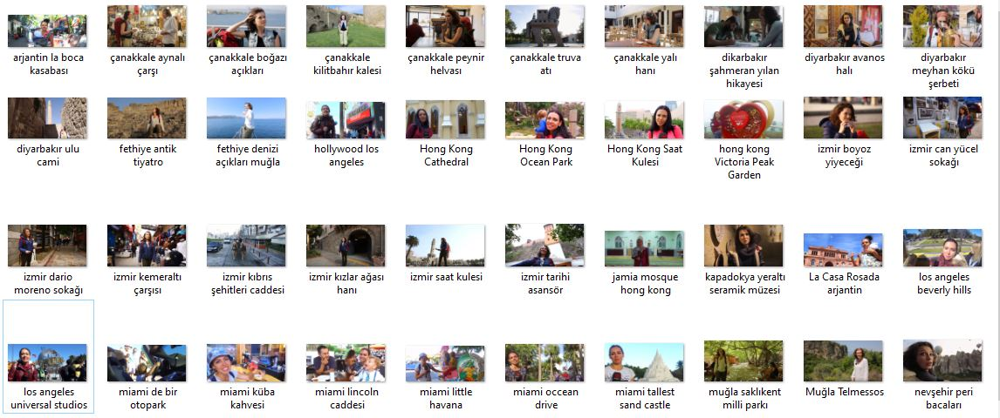

# Sight-See-Save Application

  


**An iOS-Swift Mobile Application for Travelers**

---

## Table of Contents
1. [Overview](#overview)
2. [Features](#features)
   - [Travel Diary Module](#travel-diary-module)
   - [Photo Management Module](#photo-management-module)
   - [Location Tracking Module](#location-tracking-module)
   - [Cloud Storage & Synchronization](#cloud-storage--synchronization)
   - [User Interface Design](#user-interface-design)
3. [Technologies Used](#technologies-used)
4. [Setup Instructions](#setup-instructions)
5. [Usage](#usage)
6. [Achievements](#achievements)
7. [License](#license)

---

## Overview

The **Sight-See-Save Application** is a mobile app built for iOS devices, designed to enhance the travel experience by providing tools for saving locations, archiving photos, and adding personal notes. Developed as a university project at **Istanbul Ayvansaray University**, the application focuses on simplicity, usability, and real-time data synchronization via **Firebase**.

Key highlights of the app include its ability to work offline, seamless integration with GPS for tracking locations, and a photo organization system tied to user-selected places. With these features, Sight-See-Save serves as the ultimate travel companion.

---

## Features

### Travel Diary Module
The **Travel Diary Module** serves as the core of the application, enabling users to:
- Save travel-related notes for each location.  
- Attach custom tags for easier categorization.  
- Manage and review their travel history through a timeline-based interface.

#### Implementation Details:
- **Core Data Framework** was used to store diary entries locally.
- Notes are synced to Firebase Realtime Database for multi-device accessibility.

---

### Photo Management Module
The **Photo Management Module** provides a comprehensive way to organize and view travel photos:
- Automatically link photos to the visited locations.  
- Display images in a gallery view sorted by date or location.  
- Enable easy sharing of individual photos or albums with friends.

#### Implementation Details:
- Photos are stored in **Firebase Storage**, ensuring secure backups.  
- Metadata such as geolocation and timestamps are used for sorting and categorization.

---

### Location Tracking Module
The **Location Tracking Module** enhances the app's functionality by integrating GPS services:
- Pin locations on a custom map when visiting new places.  
- Provide route suggestions or distance tracking between saved locations.  
- Visualize travel history on an interactive map.

#### Implementation Details:
- **Core Location Framework** was used for GPS tracking.  
- **MapKit** enabled the creation of custom maps for a personalized travel experience.

---

### Cloud Storage & Synchronization
The **Cloud Storage Module** ensures that all user data is securely stored and accessible across devices:
- Store notes, photos, and location data in Firebase Realtime Database and Firebase Storage.  
- Automatically synchronize offline data when reconnected to the internet.  
- Provide seamless cross-device data sharing.

#### Implementation Details:
- Firebase SDK was utilized for real-time synchronization.  
- Offline caching ensures uninterrupted usage even in low-connectivity areas.

---

### User Interface Design
The **User Interface Module** focuses on providing a clean and user-friendly experience:
- Easy navigation with a bottom tab bar for quick access to modules.  
- Custom animations for smooth transitions between screens.  
- Dark mode compatibility for better usability in low-light environments.

#### Implementation Details:
- Designed with **UIKit** for flexibility and performance.  
- Focused on minimalist design principles to prioritize usability.

---

## Technologies Used

- **Programming Language:** Swift (iOS)  
- **Frameworks:**  
  - UIKit (User Interface)  
  - Core Location (GPS Tracking)  
  - Core Data (Local Data Storage)  
  - MapKit (Custom Mapping)  

- **Cloud Services:**  
  - Firebase Realtime Database  
  - Firebase Storage  

- **Tools:**  
  - Xcode (Development Environment)  
  - Firebase SDK  

---

## Setup Instructions

1. **Clone the Repository:**  
   ```bash
   git clone https://github.com/your-username/sight-see-save.git
   cd sight-see-save
   ```

2. **Install Dependencies:**  
   - Open the project in Xcode and ensure Firebase SDK and other required libraries are installed.

3. **Configure Firebase:**  
   - Create a Firebase project.  
   - Download and include the `GoogleService-Info.plist` file in the project.  
   - Enable Realtime Database, Firebase Storage, and Authentication in the Firebase Console.

4. **Run the Application:**  
   - Connect an iOS device or use the iOS simulator to run the app.  
   - Build and run the project in Xcode.

---

## Usage

1. **Saving a Location:**  
   - Open the app and allow GPS access.  
   - Add a new location by pinning it on the map.  
   - Attach notes and photos to the saved location.

2. **Organizing Photos:**  
   - Access the photo gallery from the main menu.  
   - View photos by location or date.  
   - Share your favorite moments with friends.

3. **Viewing Travel History:**  
   - Use the travel map to visualize your visited places.  
   - Tap on pins to review notes and photos attached to a specific location.

---

## Achievements

- Successfully integrated Firebase for real-time data storage and synchronization.  
- Designed a seamless user experience praised for its practicality and simplicity.  
- Delivered offline capabilities with automatic data syncing upon reconnection.

---

## License

This project is licensed under the MIT License. See the `LICENSE` file for more details.

